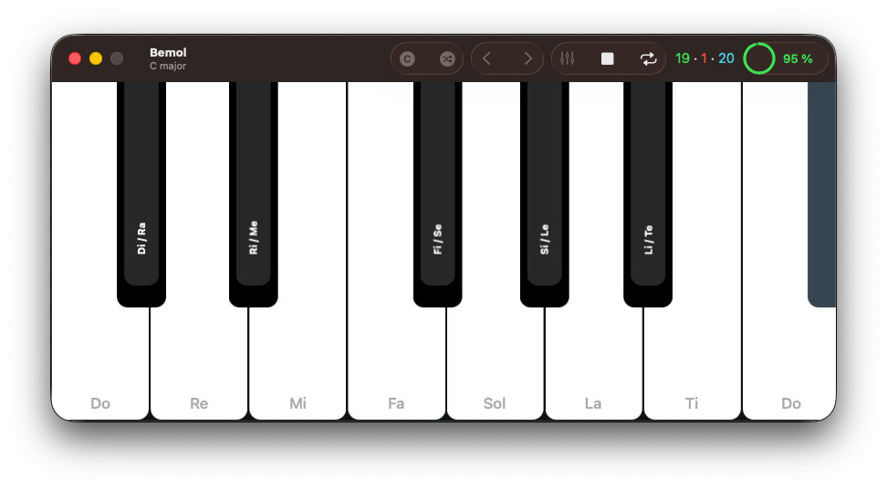

# 🎵 Bemol
       

**Bemol** is a **free** and **open-source** ear training app that helps music hobbyists and music students train and develop [relative pitch](https://en.wikipedia.org/wiki/Relative_pitch), the ability to recognize a played musical note in a given [tonal context](https://en.wikipedia.org/wiki/Tonic_(music)).

 

 

## Contents
- [Background](#background)
- [Download](#download)
- [How it works](#how-it-works)
- [Building from sources](#building-from-sources)
- [License](#license)

# Background

**Bemol** helps people learn the character of each musical note by having them internalize how each note relates to its nearest [tonic](https://en.wikipedia.org/wiki/Tonic_(music)) in a given [key](https://en.wikipedia.org/wiki/Key_(music)). In each practice session, the user is prompted to identify a series of played notes. Before each note, Bemol plays a [I - IV - V - I cadence](https://en.wikipedia.org/wiki/Cadence) to establish the key. After the user has identified the note, a short melody is played to resolve the note to the nearest tonic. Listening to this final resolution helps cement the relationship between the note and the tonic in the ear and the mind.

As this process repeats, the user starts to internalize the character of each note in a given tonal context. This helps develop [relative pitch](https://en.wikipedia.org/wiki/Relative_pitch) and eventually they will have a much easier time recognizing any note as long as a tonal context is clearly established.

This ear training method was first described and implemented by [Alain Benbassat](https://www.miles.be) in his free [Functional Ear Trainer desktop app](https://www.miles.be/software/functional-ear-trainer-v2/). **Bemol** is simply a native, free and open-source implementation of the method for macOS.

# Download

You can download the latest version from the [releases page](https://github.com/ftchirou/Bemol/releases/latest). The minimum version of macOS required to run Bemol is **26.4**.

# How it works

**Bemol** is organized in a series of progressive levels. The first level consists only of the **first 4 notes** in the key of **C major**. Once the user has at least 90% accuracy in this level, they can move to the next one, where they can practice the **next 4 notes**.

Once the entire scale is mastered, the next level will introduce **chromatic notes**. After this, a new key is introduced. This can go on until the user has practiced in all 12 major and 12 minor keys. Or they can choose just to practice in a random key after they have mastered the keys of C major and C minor.

# Building from sources

1. Install [Xcode](https://developer.apple.com/xcode/). The minimum required version is [26.5](https://developer.apple.com/documentation/xcode-release-notes/xcode-26_5-release-notes).
2. In a terminal, clone the repository and run `cd Bemol/`.
4. Run `open Bemol.xcodeproj` to open it in Xcode.
5. Select the `Bemol.macOS` scheme and press `Run` in Xcode to build and launch the app.

> [!TIP]
> To be able to hear piano sounds (and not sine waves), you'll need to download a [sound font](https://en.wikipedia.org/wiki/SoundFont) in the `sf2` format and save it under `Bemol/Shared/Resources/sound_font.sf2`. [MuseScore](https://musescore.org/en) provides an excellent and open-source sound font that you can download [here](https://musescore.org/en/handbook/3/soundfonts-and-sfz-files#list) (look for `MuseScore_General`).

# License

The code and data files in this repository are licensed under the terms of the version 3 of the GNU General Public License as published by the Free Software Foundation. See the [LICENSE](./LICENSE) file for a copy of the license.
